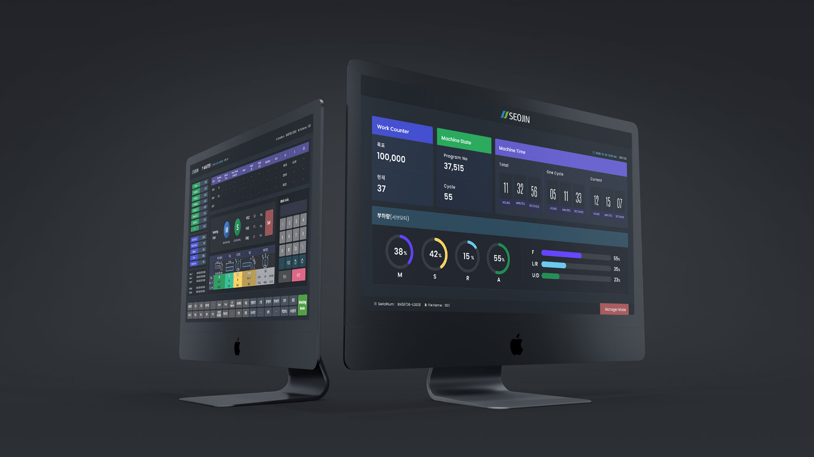
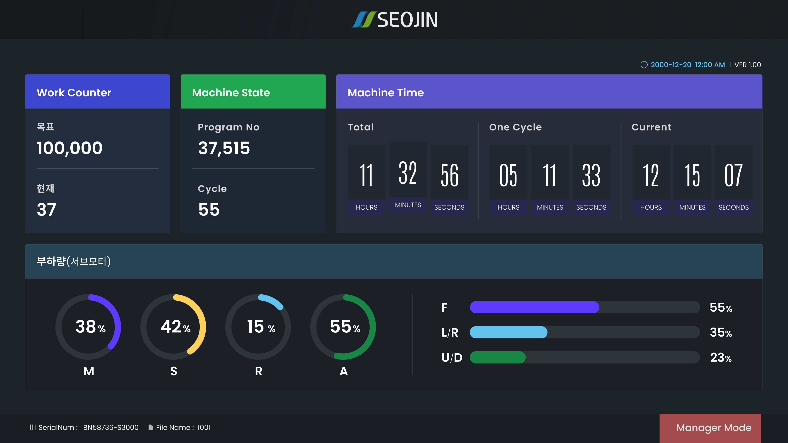
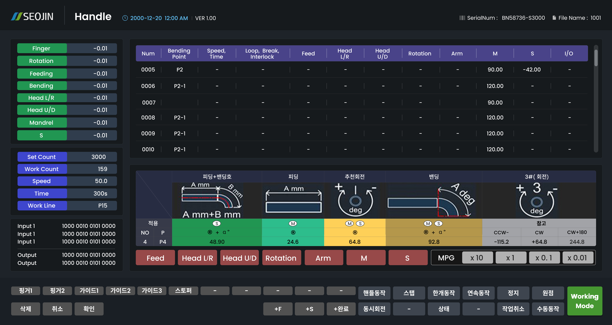
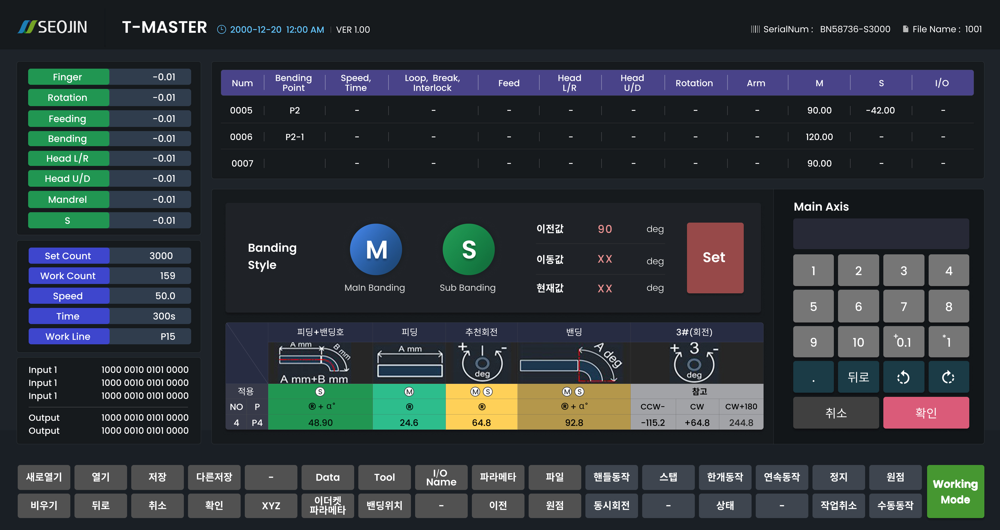
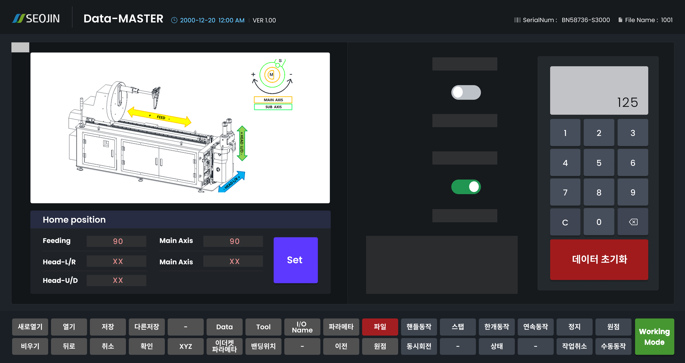

# ⚙️ Seojin Tech CNC HMI

<a href="https://seoldi.github.io/seojin-hmi/demo.html" target="_blank">▶ 라이브 데모 (21 screens)</a> &nbsp;|&nbsp;
<a href="https://youtu.be/PuTYs1BSlCA" target="_blank">🎬 실기계 가동 영상</a>

---

## 📸 Screenshots

### 제어 화면 · Control Screens

| 메인 · Main | 핸들 · Handle | T-마스터 · T-Master | 데이터 마스터 · Data Master |
|:---:|:---:|:---:|:---:|
|  |  |  |  |

---

실제 CNC 3D 파이프 밴딩 머신에 탑재된 Android HMI 제어 소프트웨어 UI/UX 리디자인입니다.  
공장 현장 작업자가 장갑을 낀 채 조작하는 환경을 고려해, 복잡한 서보축 파라미터를 13개 화면에 조작 순서대로 분리했습니다.  
웹 퍼블리싱 코드를 Android WebView로 기계에 직접 탑재하는 방식으로 납품했습니다.

### 주요 기능

**서보축 제어 (13화면)**
- Feeding · Rotation · Head · Arm 축별 파라미터 분리
- 수치 오류가 즉시 불량으로 이어지는 환경에서 오조작 최소화 설계
- 큰 터치 타깃 · 명확한 상태 표시 (장갑 착용 현장 최적화)

**데이터 관리**
- Data Master / Data Parameter — 서보 데이터 입력·관리
- File Master — 작업 파일 저장·불러오기
- IO Manager — 입출력 포트명 설정

**시스템**
- Master / Tool Master / T-Master — 기기 마스터 설정
- Alarm History — 알람 이력 조회
- Android WebView 연동 — 웹 코드를 기계에 직접 탑재

### 스택
- HTML5 / CSS3 / JavaScript (jQuery)
- 폰트: Poppins (영문), Noto Sans KR (한글), Antonio (숫자)
- `demo.html` — iframe + `transform: scale` 데모 래퍼, HMI 소스 파일 무변경

### 담당 업무
기획 스펙 수령 후 UI/UX 디자인 및 프론트엔드 퍼블리싱 단독 수행 (1인).  
화면 구조 재설계, Figma 디자인, 전 화면 동작하는 HTML/CSS/JS 퍼블리싱 → Android WebView 탑재 납품까지 완료.

> 기간: 2020.01–2020.06 (6개월)

---

A UI/UX redesign of the Android HMI control software for an industrial CNC 3D pipe-bending machine used on factory floors.  
Complex servo-axis parameters are split across 13 screens in operating order, designed for gloved hands with large touch targets and clear status indicators.  
Delivered as HTML/CSS/JS code mounted directly onto the machine as an Android WebView.

### Features

**Servo Axis Control (13 screens)**
- Separate parameter screens for Feeding, Rotation, Head, and Arm axes
- Designed to minimize mis-operation in a precision environment where one wrong number causes an immediate defective part
- Large touch targets and unambiguous status indicators for gloved factory-floor operation

**Data Management**
- Data Master / Data Parameter — servo data entry and management
- File Master — save and load work files
- IO Manager — input/output port naming

**System**
- Master / Tool Master / T-Master — device master configuration
- Alarm History — alarm log viewer
- Android WebView integration — web code mounted directly on the machine

### Stack
- HTML5 / CSS3 / JavaScript (jQuery)
- Fonts: Poppins (EN), Noto Sans KR (KR), Antonio (numbers)
- `demo.html` — iframe + `transform: scale` viewer; HMI source files untouched

### Role
Sole designer and front-end developer. Received planning specs from the manufacturer and delivered the complete scope — screen restructure, Figma design, full HTML/CSS/JS publishing, and final Android WebView deployment — solo.

> Period: Jan–Jun 2020 (6 months)
